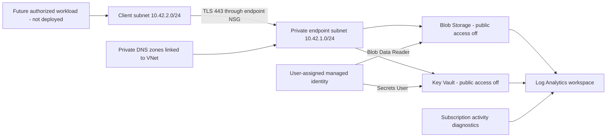

# Azure Secure Infrastructure with Terraform

A personal cloud-security lab that defines private Azure Storage and Key Vault access,
resource-scoped read permissions, and centralized diagnostic logging. It demonstrates
how security controls fit together in infrastructure code without requiring a running
workload or putting secret values into Terraform.

**Validation:** Terraform 1.16.4, AzureRM 4.81.0. Formatting and schema validation passed;
two mocked Terraform test runs passed. **No real Azure plan, apply, network probe,
RBAC access test, or log-ingestion test has been performed.**

## Architecture



## Local checks without cloud resources

Install Terraform 1.7+ (tested with 1.16.4). Initial setup downloads the locked AzureRM
provider from HashiCorp; subsequent mock tests require no Azure credentials. Run from
this repository root:

```sh
terraform init -backend=false -input=false
terraform fmt -check -recursive
terraform validate
terraform test -no-color
python scripts/estimate_cost.py
```

Python 3.11+ is optional and used only for the cost illustration. See genuine
[validation output](evidence/local-validation.txt) and [cost output](evidence/cost-estimate.json).
The mocked provider plans resource configuration in memory; these tests do not prove
Azure accepts a deployment or that security controls work at runtime.

## Security decisions

| Control | Implementation | Boundary |
| --- | --- | --- |
| Identity | Managed identity with Storage Blob Data Reader at account scope and Key Vault Secrets User at vault scope | Read access spans this dedicated lab account/vault; narrow further for mixed workloads |
| Network | Public data access off, two private endpoints, linked private DNS, endpoint-subnet NSG allows only client-subnet TLS | Client workload/VPN and client-subnet hardening are not deployed |
| Encryption | HTTPS-only, minimum TLS 1.2, infrastructure encryption plus platform-managed storage encryption | No customer-managed key lifecycle is claimed |
| Secrets | Vault RBAC, soft delete, purge protection; no secret resources in Terraform | An authorized secret writer and private client are separate prerequisites |
| Logging | Vault AuditEvent, blob read/write/delete, subscription administrative/security/policy events | Workspace uses normal Azure Monitor endpoints; no AMPLS isolation or Sentinel onboarding |

The deployment operator is separate from the workload identity. The operator needs
resource creation permissions in the lab group, permission to assign roles at the
two resource scopes, and diagnostic-settings write permission at subscription scope.
Do not grant the workload Owner or Contributor to make a failing deployment succeed.
Provider auto-registration is disabled: register needed providers through an authorized
subscription administrator. See [deployment guide](docs/deployment.md).

## Structure and evidence

- `versions.tf`, `.terraform.lock.hcl`: CLI/provider constraints and checksums.
- `main.tf`: resources, resource-scoped RBAC, diagnostics, private networking.
- `variables.tf`, `terraform.tfvars.example`: input validation and nonsecret examples.
- `tests/security.tftest.hcl`: mocked security assertions and invalid-input rejection.
- [Demo/interview guide](docs/walkthrough.md), [costs and cleanup](docs/costs-cleanup.md),
  [official references](docs/references.md).

The local checks passed. Runtime DNS resolution, endpoint reachability, managed-identity
permissions, log arrival, resource-name availability, Azure Policy compatibility, quotas,
and region support remain unverified. The client subnet has no workload and no custom
outbound firewall. No secret is initialized. These are explicit integration boundaries.

## Costs and cleanup

Local validation creates no Azure bill. The included illustrative assumptions calculate
**USD 28.60 per month**: two endpoints at $0.01/hour for 730 hours ($14.60), 0.1 GB/day
of logs at an assumed $3/GB ($9), and a $5 allowance. This is not a current price quote
or a spending cap; price it for your region and agreement before approving deployment.
Cleanup requires reviewing a destroy plan; purge protection keeps deleted vaults
recoverable for the retention period. Full steps are in the cleanup guide.

**Resume bullet:** Developed a personal Azure security lab in Terraform with private
endpoints, resource-scoped managed-identity permissions, Key Vault protection, storage
encryption controls, and audit logging; validated configuration and mocked security tests locally.

MIT licensed. State, plans, credentials, and real inputs must never be committed.
